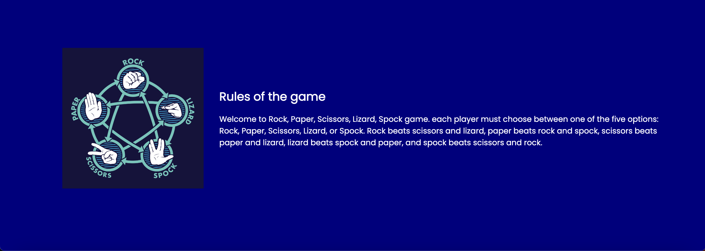
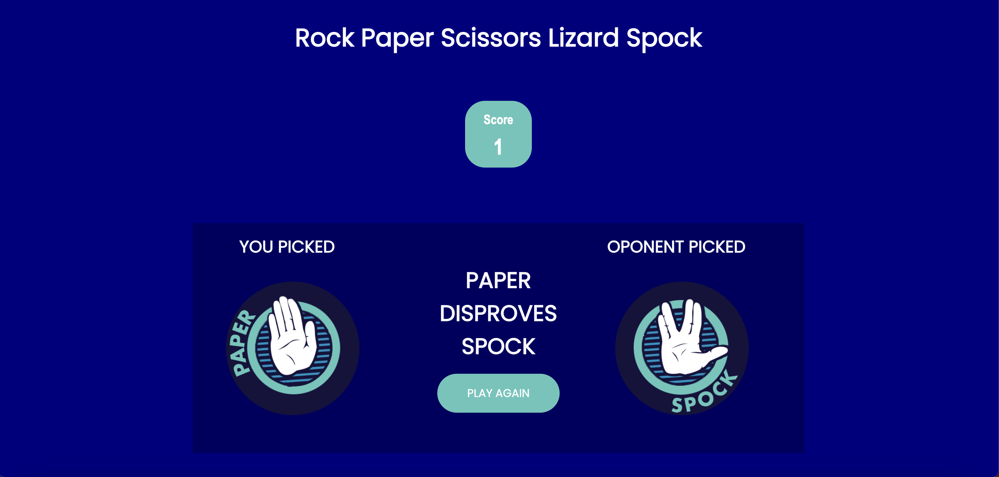

# Rock, Paper, Scissors, Lizard, Spock

Rock, Paper, Scissors, Lizard, Spock is a fictional game introduced by Sheldon from the Big Bang Theory TV show. This is essentially a classical Rock, Paper, Scissors game and it functions in a way where you are playing vs the computer. Main idea in the game is to pick a character that beats the character that computer picked, now this is where it becomes interesting, in order to beat computer, you need to know which character is more powerful.

You have five options to choose from and the rules are as follows: Rock beats scissors and lizard, paper beats rock and Spock, scissors beat paper and lizard, lizard beats Spock and paper, and Spock beats scissors and rock. And logic for this game goes like this: scissors decapitate lizard, scissors cuts paper, paper covers rock, rock crushes lizard, lizard poisons Spock, Spock smashes scissors, scissors decapitate lizard, lizard eats paper, paper disproves Spock, Spock vaporizes rock, and as it always has, rock crushes scissors.

The main idea around this game is to interduce more options to the classical version of the game.

## Features

**Scoreboard**

* Features the name of the game and a scoreboard that will tell you how many times did you beat the computer.

**Game Options**

* Options Rock, Paper, Scissors, Lizard and Spock

**Game rules**

* Game rules consists of an image that visually explains the rules and an actual rule book next to the picture.

**Final reuslt**

* When you pick an option game will give you a message and decide whether you win or lose

## Testing

* I tested that this page works in different browsers Chrome, Safary, Firefox.
* I confirm that this project is responsive, looks good and functions on all standard screen sizes using the devtools device toolbar.
* I confirm that all sections of the game are readable and easy to understand.
* I have confirmed that the game works, changes the scoreboard and win/loss description.

## Bugs

* No bugs were found on the page.

## Validator test

1. HTML
   * No errors were detected when running the code trough official W3C validator

2. CSS
   * No errors were detected when running the code trough official (Jigsaw) validator

3. Accessibility
   * I confirmed that the colors and font I used are easy to read and accessible by running it trough lighthouse in devtools.

## Unfixed bugs

* No unfixed bugs

## Deploiment

1. The site is deployed to github pages:
   * In the GitHub repository, navigate to Settings tab,
   * From the source section drop-down menu, select the Master Branch,
   * Once a Master Branch has been selected, the page provided the link to the complete Website.

The live link can be found here: [Rock, Paper, Scissors, Lizard, Spock](https://ocicv.github.io/rock-paper-scissors-lizard-spock/)

## Credits

**Content**

* The text for the rulebook was taken from  <https://bigbangtheory.fandom.com/wiki/Rock,_Paper,_Scissors,_Lizard,_Spock>

**Media**

The pictures for the option were taken from <https://www.akshaybahadur.com/post/rock-paper-scissors-lizard-spock>

Resources and tutorials that helped me create this page:
<https://realpython.com/python-rock-paper-scissors/>
https://www.freecodecamp.org/news/python-string-replace-function-in-python-for-substring-substitution/
https://stackoverflow.com/questions/27337331/how-do-i-make-a-score-counter-in-python

